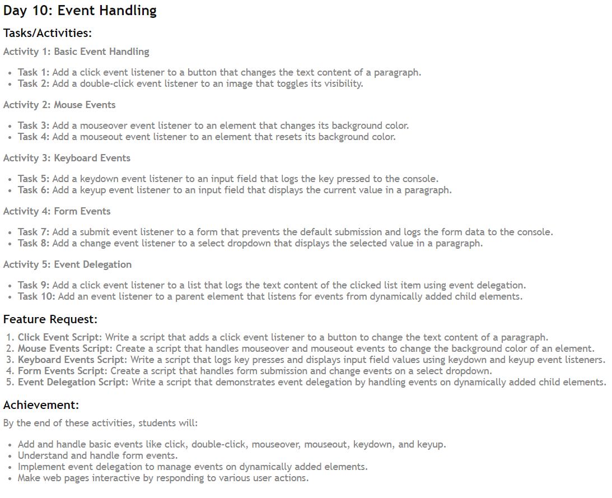

<div align="center">
  <h1> 30 Days Of JavaScript: Event Listeners  </h1>

<sub>Author: Debashis Paul<br>
<small> July, 2024</small>
</sub>
</div>

<hr>

Welcome to Day 10 of JavaScript Basics! Today, we'll explore Event Handling. Common HTML events:onclick, onchange, onmouseover, onmouseout, onkeydown, onkeyup, onload. We can add event listener method to any DOM object. We use addEventListener() method to listen different event types on HTML elements. The addEventListener() method takes two arguments, an event listener and a callback function.

<hr>

## Activity 1: Basic Event Handling

**Task 1:** Add a click event listener to a button that changes the text content of a paragraph.

```html

<!-- Activity 1: Basic Event Handling -->
<!-- Task 1: Add a click event listener to a button that changes the text content of a paragraph. -->

<!DOCTYPE html>
<html lang="en">
<head>
    <meta charset="UTF-8">
    <meta name="viewport" content="width=device-width, initial-scale=1.0">
    <title>Event Handling</title>
    <style>
        body {
            text-align: center;
            background-color: #101426;
            color: white;
            font-family: Arial, sans-serif;
            padding-top: 100px;

        }
        #para {
            font-size: 20px;
            color: #f1f1f1;
            font-family: 'Lucida Sans', 'Lucida Sans Regular', 'Lucida Grande', 'Lucida Sans Unicode', Geneva, Verdana, sans-serif;
        }
        #btn {
            padding: 10px 20px;
            background-color: #FF7700;
            color: #414141;
            border: none;
            cursor: pointer;
            font-size: 16px;
            border-radius: 5px;
        }
    </style>
</head>
<body>
    <button id="btn">Change Text</button>
    <p id="para">My Name is Debashis Paul</p>

    <script>

        /*
        const btn = document.getElementById('btn');
        const para = document.getElementById('para');

        btn.addEventListener('click', () => {
            para.textContent = 'and I am a Web Developer';
        });
        */

        //Another way to do the same thing
        document.getElementById('btn').addEventListener('click', () => {
            document.getElementById('para').textContent = 'and I am a Web Developer';
        });
        
    </script>
    
</body>
</html>
```

**Task 2:** Add a double-click event listener to an image that toggles its visibility.

```html

<!-- Task 2: Add a double-click event listener to an image that toggles its visibility. -->

<!DOCTYPE html>
<html lang="en">
<head>
    <meta charset="UTF-8">
    <meta name="viewport" content="width=device-width, initial-scale=1.0">
    <title>double-click Event</title>
    <style>
        body {
            text-align: center;
            background-color: #101426;
            color: white;
            font-family: Arial, sans-serif;
            padding-top: 90px;
        }
        img {
            width: 50%;
            margin: 0 auto;
            border-radius: 10px;
            border: #FF7700 2px solid;
        }
        p {
            font-size: 20px;
            color: #f1f1f1;
            font-family: 'Lucida Sans', 'Lucida Sans Regular', 'Lucida Grande', 'Lucida Sans Unicode', Geneva, Verdana, sans-serif;
            padding: 20px;
        }
    </style>
</head>
<body>
    
    <p>Chai is a Hindi word for tea. It is a popular hot beverage in India and is made by brewing tea leaves with milk, sugar, and spices. 
        It is usually served in a small cup and is enjoyed by people of all ages. 
        Chai is known for its unique flavor and aroma and is often enjoyed with snacks or breakfast.
    </p>

    <script>
        
        const img = document.getElementById('img');

        img.addEventListener('dblclick', () => {
            if (img.style.display === 'block') {
                img.style.display = 'none';
            } else {
                img.style.display = 'block';
            }
        });
    </script>
    
</body>
</html>
```

## Activity 2: Mouse Events

**Task 3:** Add a mouseover event listener to an element that changes its background color.

```html
<!-- Activity 2: Mouse Events -->

<!-- Task 3: Add a mouseover event listener to an element that changes its background color. -->
 <!DOCTYPE html>
 <html lang="en">
 <head>
    <meta charset="UTF-8">
    <meta name="viewport" content="width=device-width, initial-scale=1.0">
    <title>Mouseover Event</title>
    <style>
        body {
            text-align: center;
            background-color: #101426;
            color: white;
            font-family: Arial, sans-serif;
            padding-top: 100px;
        }
        #box {
            width: 200px;
            height: 200px;
            background-color: #FF7700;
            margin: 0 auto;
        }
    </style>
 </head>
 <body>
    <div id="box"></div>
    <script>
        /*
        const box = document.getElementById('box');
        box.addEventListener('mouseover', () => {
            box.style.backgroundColor = '#fff';
        });
        */

        //Another way to do the same thing
        document.getElementById('box').addEventListener('mouseover', () => {
            document.getElementById('box').style.backgroundColor = '#fff';
        });
    </script>
    
 </body>
 </html>
```

**Task 4:** Add a mouseout event listener to an element that resets its background color.

```javascript
/* Task 4: Add a mouseout event listener to an element that resets its background color. */

<!DOCTYPE html>
<html lang="en">
<head>
    <meta charset="UTF-8">
    <meta name="viewport" content="width=device-width, initial-scale=1.0">
    <title>MouseOut Event</title>
    <style>
        body {
            text-align: center;
            background-color: #101426;
            color: white;
            font-family: Arial, sans-serif;
            padding-top: 100px;
        }
        #box {
            width: 200px;
            height: 200px;
            margin: 0 auto;
        }
    </style>
</head>
<body> 
    <div id="box" ></div>
    <script>
        document.getElementById('box').addEventListener('mouseover', () => {
            document.getElementById('box').style.backgroundColor = '#fff';
        });

        document.getElementById('box').addEventListener('mouseout', () => {
            document.getElementById('box').style.backgroundColor = '#FF7700';
        });
    </script> 
    
</body>
</html>

```

## Activity 3: Keyboard Events

**Task 5:** Add a keydown event listener to an input field that logs the key pressed to the console.

```html
<!-- Activity 3: Keyboard Events -->

<!-- Task 5: Add a keydown event listener to an input field that logs the key pressed to the console. -->

<!DOCTYPE html>
<html lang="en">
<head>
    <meta charset="UTF-8">
    <meta name="viewport" content="width=device-width, initial-scale=1.0">
    <title>Keydown Event</title>
    <style>
        body {
            text-align: center;
            background-color: #101426;
            color: white;
            font-family: Arial, sans-serif;
            padding-top: 100px;
        }
        input {
            padding: 10px;
            font-size: 16px;
            border-radius: 5px;
            border: none;
        }
    </style>
</head>
<body>
    <input type="text" id="input" placeholder="Press any key...">
    <script>
        document.getElementById('input')
        .addEventListener('keydown', (event) => {
            console.log("Keydown: ", event.key);
        });
    </script>
    
</body>
</html>


```

**Task 6:** Add a keyup event listener to an input field that displays the current value in a paragraph.

```html
<!-- Task 6: Add a keyup event listener to an input field that displays the current value in a paragraph. -->

<!DOCTYPE html>
<html lang="en">
<head>
    <meta charset="UTF-8">
    <meta name="viewport" content="width=device-width, initial-scale=1.0">
    <title>keyup Event</title>
    <style>
        body {
            text-align: center;
            background-color: #101426;
            color: white;
            font-family: Arial, sans-serif;
            padding-top: 100px;
        }
        input {
            padding: 10px;
            font-size: 16px;
            border-radius: 5px;
            border: none;
            background-color: #FF7700;
        }
    </style>
</head>
<body>
    <input type="text" id="input" placeholder="Type something...">
    <p id="para"></p>

    <script>
        document.getElementById('input')
        .addEventListener('keyup', (event) => {
            document.getElementById('para').textContent = event.target.value;
        });
    </script>
    
</body>
</html>
```

## Activity 4: Form Events

**Task 7:** Add a submit event listener to a form that prevents the default submission and logs the form data to the console.

```html
<!-- Activity 4: Form Events -->

<!-- Task 7: Add a submit event listener to a form that prevents the default submission and logs the form data to the console. -->

<!DOCTYPE html>
<html lang="en">
<head>
    <meta charset="UTF-8">
    <meta name="viewport" content="width=device-width, initial-scale=1.0">
    <title>Document</title>
    <style>
        body {
            text-align: center;
            background-color: #101426;
            color: white;
            font-family: Arial, sans-serif;
            padding-top: 100px;
            display: flex;
            justify-content: center;
            align-items: center;
        }
        input {
            padding: 10px;
            font-size: 16px;
            border-radius: 5px;
            border: none;
            background-color: #FF7700;
            margin-bottom: 10px;
        }
        button {
            padding: 10px;
            font-size: 16px;
            border-radius: 5px;
            border: none;
            background-color: #FF7700;
            color: white;
            cursor: pointer;
            margin-top: 10px;
        }
    </style>
</head>
<body>
    
        <form id="form">
            <input type="text" name="name" placeholder="Name">
            <button type="submit">Submit</button>
        </form>
    
    <script>    
        document.getElementById('form').addEventListener('submit', function(e) {
            e.preventDefault();
            console.log(e.target.name.value);
        });

    </script>
    
</body>
</html>


```

**Task 8:** Add a change event listener to a select dropdown that displays the selected value in a paragraph.

```html
<!-- Task 8: Add a change event listener to a select dropdown that displays the selected value in a paragraph. -->

<!DOCTYPE html>
<html lang="en">
<head>
    <meta charset="UTF-8">
    <meta name="viewport" content="width=device-width, initial-scale=1.0">
    <title>change Event</title>
    <style>
        body {
            text-align: center;
            background-color: #101426;
            color: white;
            font-family: Arial, sans-serif;
            padding-top: 100px;
            display: flex;
            justify-content: center;
            align-items: center;
        }
        select {
            padding: 10px;
            font-size: 16px;
            border-radius: 5px;
            border: none;
            background-color: #FF7700;
            margin-bottom: 10px;
        }
        p {
            font-size: 16px;
            background-color: #FF7700;
            padding: 10px;
            border-radius: 5px;
            margin-left: 10px;

        }
    </style>
</head>
<body>
    <select id="select">
        <option value="1">Option 1</option>
        <option value="2">Option 2</option>
        <option value="3">Option 3</option>
        <option value="4">Option 4</option>
    </select>
    <p id="selectedValue"></p>

    <script>
        document.getElementById('select').addEventListener('change', function(e) {
            document.getElementById('selectedValue').innerText = e.target.value;
        });
    </script>
    
</body>
</html>


```

## Activity 5: Event Delegation

**Task 9:** Add a click event listener to a list that logs the text content of the clicked list item using event delegation.

```html

<!-- Activity 5: Event Delegation -->

<!-- Task 9: Add a click event listener to a list that logs the text content of the clicked list item using event delegation. -->

<!DOCTYPE html>
<html lang="en">
<head>
    <meta charset="UTF-8">
    <meta name="viewport" content="width=device-width, initial-scale=1.0">
    <title>Document</title>
    <style>
        body {
            text-align: center;
            background-color: #101426;
            color: white;
            font-family: Arial, sans-serif;
            padding-top: 100px;
            display: flex;
            justify-content: center;
            align-items: center;
        }
        ul {
            list-style: none;
            padding: 0;
        }
        li {
            padding: 10px;
            background-color: #FF7700;
            margin-bottom: 10px;
            cursor: pointer;
        }
    </style>
</head>
<body>
        
        <ul id="list">
            <li>Item 1</li>
            <li>Item 2</li>
            <li>Item 3</li>
            <li>Item 4</li>
        </ul>
    
        <script>
            document.getElementById('list').addEventListener('click', function(e) {
                if(e.target.tagName === 'LI') {
                    console.log("Clicked item: ", e.target.textContent);
                }
            });
        </script>
    
</body>
</html>

```

**Task 10:** Add an event listener to a parent element that listens for events from dynamically added child elements.

```html

<!-- Task 10: Add an event listener to a parent element that listens for events from dynamically added child elements. -->

<!DOCTYPE html>
<html lang="en">
<head>
    <meta charset="UTF-8">
    <meta name="viewport" content="width=device-width, initial-scale=1.0">
    <title>Document</title>
    <style>
        body {
            text-align: center;
            background-color: #101426;
            color: white;
            font-family: Arial, sans-serif;
            padding-top: 100px;
            display: flex;
            justify-content: center;
            align-items: center;
        }
        button {
            padding: 10px;
            font-size: 16px;
            border-radius: 5px;
            border: none;
            background-color: #FF7700;
            color: white;
            cursor: pointer;
            margin-top: 10px;
        }
    </style>
</head>
<body>
    <div id="parent">
        <ul id="addList">
            <li>item 1</li>
            <li>item 2</li>
            <li>item 3</li>
            <li>item 4</li>
        </ul>
        <button id="addItem">add</button>
    </div>

    <script>
        document.getElementById('addItem').addEventListener('click', function() {
            const li = document.createElement('li');
            li.textContent = 'item ' + (document.getElementById('addList').childElementCount + 1);
            document.getElementById('addList').appendChild(li);
            this.innerHTML = 'add ' + (document.getElementById('addList').childElementCount + 1);
        });

        document.getElementById('addList').addEventListener('click', function(e) {
            if (e.target.tagName === 'LI') {
                console.log(e.target.textContent);
            }
        });
    </script>
    
</body>
</html>
```

## Feature Request

1. **Click Event Script:** Add a click event listener to a button to change the text content of a paragraph. (Already covered in Activity 1, Task 1)

2. **Mouse Events Script:** Handle mouseover and mouseout events to change the background color of an element. (Already covered in Activity 2, Tasks 3 and 4)

3. **Keyboard Events Script:** Log key presses and display input field values using keydown and keyup event listeners. (Already covered in Activity 3, Tasks 5 and 6)

4. **Form Events Script:** Handle form submission and change events on a select dropdown. (Already covered in Activity 4, Tasks 7 and 8)

5. **Event Delegation Script:** Demonstrate event delegation by handling events on dynamically added child elements. (Already covered in Activity 5, Task 10)


<hr>

