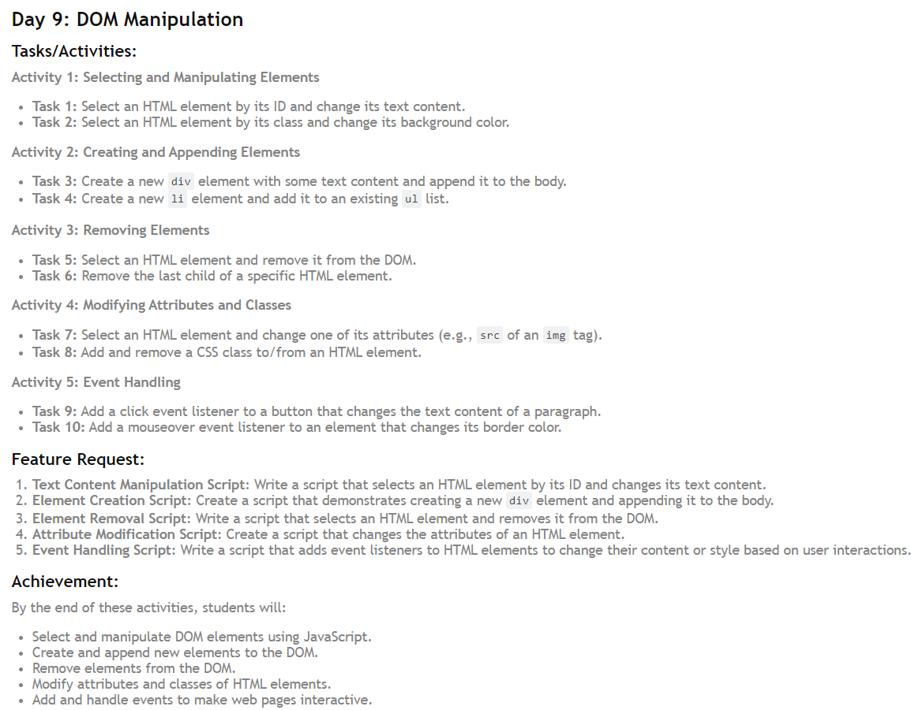

<div align="center">
  <h1> 30 Days Of JavaScript: Document Object Model(DOM)</h1>

<sub>Author:Debashis Paul<br>
<small> July, 2024</small>
</sub>

</div>

# **Day** :- 9 

## Document Object Model (DOM) 
 Toay day 9 of JavaScript Basics! Today, we'll dive into DOM Manipulation. We'll explore how to select and manipulate elements, create and append new elements, remove existing ones, modify attributes and classes, and handle events.HTML document is structured as a JavaScript Object. Every HTML element has a different properties which can help to manipulate it. It is possible to get, create, append or remove HTML elements using JavaScript. Check the examples below. Selecting HTML element using JavaScript is similar to selecting using CSS. To select an HTML element, we use tag name, id, class name or other attributes.


## Activity 1: Selecting and Manipulating Elements

**Task 1:** Select an HTML element by its ID and change its text content.

```javascript
document.getElementById("task1").textContent = "New Text Content :- Lorem ipsum dolor sit amet, consectetur adipisicing elit.";
```

**Task 2:** Select an HTML element by its class and change its background color.
```javascript
document.querySelector(".task2").style.backgroundColor = "violet";
```

## Activity 2: Creating and Appending Elements

**Task 3:** Create a new `div` element with some text content and append it to the body.
```javascript
const newDiv = document.createElement("div");
newDiv.textContent = "Added a new div element to the body.";
document.body.appendChild(newDiv);
```

**Task 4:** Create a new `li` element and add it to an existing `ul` list.

```javascript
const newLi = document.createElement("li");
newLi.textContent = "New List Item 4";
document.querySelector("ul").appendChild(newLi);
```

## Activity 3: Removing Elements

**Task 5:** Select an HTML element and remove it from the DOM.
```javascript
const elementToRemove = document.getElementById("task5");
elementToRemove.remove();
```

**Task 6:** Remove the last child of a specific HTML element.
```javascript
const parentElement = document.getElementById("task6");
parentElement.lastElementChild.remove();
```

## Activity 4: Modifying Attributes and Classes

**Task 7:** Select an HTML element and change one of its attributes (e.g., `src` of an `img` tag).
```javascript
document.querySelector("img").setAttribute("src", "./newChai.png");
```

**Task 8:** Add and remove a CSS class to/from an HTML element.
```javascript
const element = document.getElementById("task8");
element.classList.add("newClass");
element.classList.remove("oldClass");
```


## Activity 5: Event Handling

**Task 9:** Add a click event listener to a button that changes the text content of a paragraph.
```javascript
document.getElementById("task9").addEventListener("click", function () {
    document.getElementById("task9Text").textContent = "New Text: After Click the Button. The Text has been Changed!";
  });
```


**Task 10:** Add a mouseover event listener to an element that changes its border color.
```javascript
document.getElementById("task10").addEventListener("mouseover", function () {
    if ( document.getElementById("task10").style.backgroundColor === "red") {
        document.getElementById("task10").style.backgroundColor = "green";
    } else {
        document.getElementById("task10").style.backgroundColor = "red";
    }
});
```
-------------------------

## HTML File

```html
   <!-- index.html --> 
    <!DOCTYPE html>
<html lang="en">
<head>
    <meta charset="UTF-8">
    <meta name="viewport" content="width=device-width, initial-scale=1.0">
    <title>Day 9:- DOM Manipulation</title>
    <link rel="stylesheet" href="style.css">
</head>
<body>
    <h1>Day 9:- DOM Manipulation</h1>

    <!-- Activity 1: Selecting and Manipulating Elements -->

    <!-- Task 1 -->
    <div id="first">
        <h2>Task 1</h2>
        <p id="task1">Old Text Content :- Lorem ipsum dolor sit amet.</p>
    </div>

    <!-- Task 2 -->
    <div id="first">
        <h2>Task 2</h2>
        <div class="task2"><p>Change Background Color</p></div>
    </div>

    <!-- Activity 2: Creating and Appending Elements -->

    <!-- Task 3:  -->
    <div id="first">
        <h2>Task 3</h2>
        <div class="task3"><p>Some text content and append it to the body, Below here:</p></div>
    </div>

    <!-- Task 4:  --> 
    <div id="first">
        <h2>Task 4</h2>
        <div class="task4"><p>Adding new list item to the existing list:
            <ul>
                <li>Item 1</li>
                <li>Item 2</li>
                <li>Item 3</li>
            </ul>
        </p></div>
    </div>

    <!-- Activity 3: Removing Elements -->

    <!-- Task 5:  -->
    <div id="first">
        <h2>Task 5</h2>
        <div id="task4"><p>Select an HTML element and remove it from the DOM: </p></div>
        <div id="task5">
            <p> Child 1</p>
            <p> Child 2</p>
            <p> Child 3</p>      
         </div>
    </div>

    <!-- Task 6:  -->
    <div id="first">
        <h2>Task 6</h2>
        <div id="task4"><p>Remove the last child of a specific HTML element: </p></div>
        <div id="task6">
            <p> Child A</p>
            <p> Child B</p>
            <p> Child C</p>      
            <p> Child D</p>      
         </div> 
    </div>

    <!-- Activity 4: Modifying Attributes and Classes -->
     <!-- Task 7:  -->
        <div id="first">
            <h2>Task 7</h2>
            <div id="task"><p>Select an HTML element and change one of its attributes: </p></div>
            
        </div>

    <!-- Task 8:  -->
    <div id="first">
        <h2>Task 8</h2>
        <div id="task"><p> Add and remove a CSS class to/from an HTML element: </p></div>
        <p id="task8" class="old">Class Modification</p>
    </div>

    <!-- Activity 5: Event Handling -->

    <!-- Task 9:  -->
    <div id="first">
        <h2>Task 9</h2>
        <div id="task"><p>Add a click event listener to a button that changes the text content of a paragraph: </p></div>
        <button id="task9">Click Me to Change Text</button>
        <p id="task9Text">Old Text Content :- Lorem ipsum dolor sit amet.</p>
    </div>

    <!-- Task 10:  -->
    <div id="first">
        <h2>Task 10</h2>
        <div id="task"><p>Add a mouseover event listener to an element that changes its border color: </p></div>
        <div id="task10">Hover me</div>
    </div>

    <script src="script.js"></script>
</body>
</html>
```

-------------

## JavaScript File

```javascript
//script.js

// Task: 1
document.getElementById("task1").textContent = "New Text Content :- Lorem ipsum dolor sit amet, consectetur adipisicing elit.";

// Task: 2
document.querySelector(".task2").style.backgroundColor = "violet";

// Task: 3 
/*
const newDiv = document.createElement("div");
newDiv.textContent = "Added a new div element to the body.";
document.body.appendChild(newDiv);
*/

// Task: 4 
const newLi = document.createElement("li");
newLi.textContent = "New List Item 4";
document.querySelector("ul").appendChild(newLi);

// Task: 5 
const elementToRemove = document.getElementById("task5");
elementToRemove.remove();

// Task: 6
const parentElement = document.getElementById("task6");
parentElement.lastElementChild.remove();

// Task: 7
document.querySelector("img").setAttribute("src", "./newChai.png");

// Task: 8
const element = document.getElementById("task8");
element.classList.add("newClass");
element.classList.remove("oldClass");

// Task: 9
document.getElementById("task9").addEventListener("click", function () {
    document.getElementById("task9Text").textContent = "New Text: After Click the Button. The Text has been Changed!";
  });

// Task: 10
document.getElementById("task10").addEventListener("mouseover", function () {
    if ( document.getElementById("task10").style.backgroundColor === "red") {
        document.getElementById("task10").style.backgroundColor = "green";
    } else {
        document.getElementById("task10").style.backgroundColor = "red";
    }
});
```

-------------

## CSS File

```css
/* style.css */

body {
    font-family: Arial, sans-serif;
    margin: 20px;
    padding: 0;
    background-color: #0C0A09;
    color: #fff;

}


h1 {
    color: #EA580C;
    text-align: center;
    font-size: 2.5em;
  }

#first h2, img{
    background-color: #EA580C; 
    font-size: large; 
    text-align: center; 
    font-style:italic;
}
.task2 {
    padding: 10px;
    border: 1px solid #ccc;
  }
#first p, ul, li{
    text-align: center;
    font-size: large;
    font-style:italic;
    margin-bottom: 20px;
    display: block;
    
}
#first img{
    border-radius: 10px;
    margin-bottom: 20px;
    margin-left: 40%;
    margin-right: 40%;
    border: 2px solid #EA580C;
}

#first button{
    background-color: #EA580C;
    color: white;
    padding: 10px 20px;
    margin: 20px;
    border: none;
    border-radius: 5px;
    cursor: pointer;
    font-size: large;
    font-style:italic;
    display: block;
    margin-left: auto;
    margin-right: auto;
}

#first button:hover {
    background-color: #FFA500;
}

#first #task10{
    border: 1px solid rgb(239, 234, 234); 
    width: 200px; 
    height: 200px;
}
```

----------------


### Key Concepts Covered
- **Text Content Manipulation Script**: Write a script that selects an HTML element by its ID and changes its text content.
- **Element Creation Script**: Create a script that demonstrates creating a new div element and appending it to the body.
- **Element Removal Script**: Write a script that selects an HTML element and removes it from the DOM.
- **Attribute Modification Script**: Create a script that changes the attributes of an HTML element.
- **Event Handling Script**: Write a script that adds event listeners to HTML elements to change their content or style based on user interactions.

