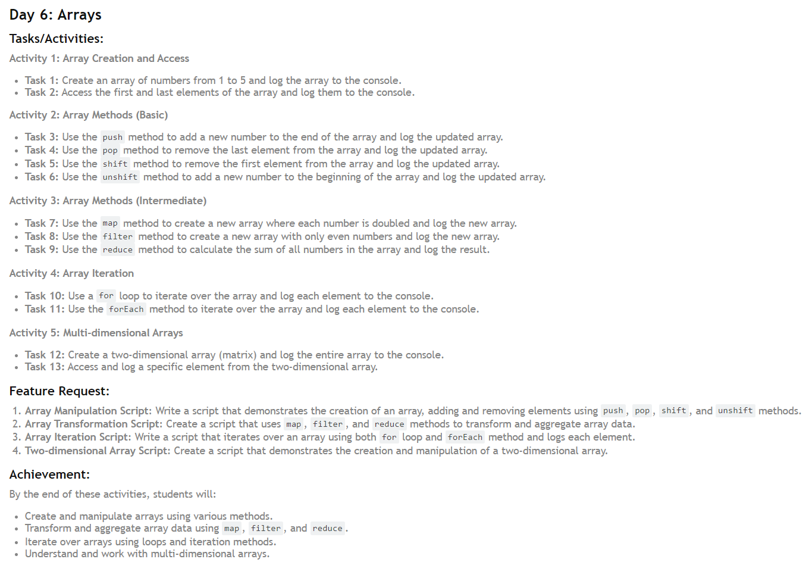

# 30 Days JavaScript Challenge with DSA

Welcome to the 30 Days JavaScript Challenge with DSA! This repository is designed to help you master JavaScript and Data Structures and Algorithms (DSA) in just 30 days.

Hello everyone,

I am Debashis Paul, and I am thrilled to share my journey through the 30-Day JavaScript Challenge by the amazing Hitesh Choudhary, founder of "Chai aur Code." This challenge aims to transform our JavaScript skills by covering core subjects, related questions, data structures and algorithms (DSA), and hands-on project creation.

## About the Course
The 30-Day JavaScript Challenge is designed to provide a structured and comprehensive approach to mastering JavaScript. Here are the key details of the course:
  - **Duration**: 30 days
  - **Content**: Core JavaScript concepts, related questions, DSA, and project creation
  - **Enrollment Deadline**: July 14th (No new enrollments will be accepted after this date 
    for this batch)
  - **Instructor**: Hitesh Choudhary

## Why I’m Excited
  1. **Structured Learning**: The course provides a clear path to mastering JavaScript with a 
     structured approach.
  2. **Community Support**: Being part of a community of like-minded learners keeps me 
     motivated.
  3. **Hands-On Projects**: Practical projects will help solidify my understanding and 
     showcase my skills.
  4. **Expert Guidance**: Learning from Hitesh Choudhary, a seasoned expert, ensures I am 
     getting top-notch instruction.

## Challenge Structure

The challenge is divided into 30 days, with each day focusing on different concepts and problems:

1. **Day 1-10**: Basic JavaScript concepts and syntax.
2. **Day 11-20**: Intermediate JavaScript concepts and DSA.
3. **Day 21-30**: Advanced JavaScript concepts and complex DSA problems.

## Goals
1. **Master Core JavaScript Concepts**: Deep dive into JavaScript fundamentals and advanced topics.
2. **Solve Complex Problems**: Improve my problem-solving skills by tackling related questions and DSA challenges.
3. **Build Real-World Projects**: Apply my knowledge to create projects that can be added to my portfolio.
4. **Engage with the Community**: Share my progress, get feedback, and support fellow learners.

## Technologies Used

- **JavaScript**: The core programming language used throughout the challenge.

## Installation

To get started with this challenge, follow these steps:

1. **Clone the repository:**

   ```bash
   git@github.com:Debashis-11101-srijib/30-Day-of-JavaScript-Challenge.git
   ```

2. **Navigate to the project directory:**

   ```bash
   30-Day-of-JavaScript-Challenge
   ```

3. **Install the dependencies (if any):**

   ```bash
   npm install
   ```

## Usage

Each day's challenge is located in its respective folder. To run a specific day's challenge:

1. Navigate to the day's directory:

   ```bash
   cd Day_1
   ```

2. Run the JavaScript file:

   ```bash
   node index.js
   ```

## Daily Challenges

Each day's folder contains a README file with the day's challenge description and instructions. The folders are organized as follows:

```
/ 30-Day-of-JavaScript-Challenge
│
├── /Day_1/             # Day 1 challenge
│   ├── index.js
│   └── README.md
├── /Day_2/             # Day 2 challenge
│   ├── index.js
│   └── README.md
...
├── /Day_30/             # Day 30 challenge
│   ├── index.js
│   └── README.md
└── README.md            # Main README file
```


## Contributing

Contributions are welcome! If you'd like to contribute, please follow these steps:

1. Fork the repository.
2. Create a new branch (`git checkout -b feature/your-feature-name`).
3. Commit your changes (`git commit -m 'Add some feature'`).
4. Push to the branch (`git push origin feature/your-feature-name`).
5. Open a pull request.

## Daily progress
I will be updating this repository daily with my progress, including code snippets, projects, and solutions to the challenges I tackle. Follow along and feel free to provide your feedback and suggestions.

## Day 1: Variables & Data Types
On the first day, I learned about variables and data types in JavaScript. Understanding how to declare and use variables, as well as the different types of data (strings, numbers, booleans, etc.), is fundamental to writing effective JavaScript code.

### Key Concepts Covered:
- Variable declaration using `var`, `let`, and `const`
- **Primitive data types**: `string`, `number`, `boolean`, `null`, `undefined`, `symbol`
- **Non-primitive data types**: `object` (including arrays and functions)
  

------------------------

## Day 2: Operators
On the second day of the 30-Day JavaScript Challenge, I focused on understanding and using various operators in JavaScript. These operators are crucial for performing calculations, making comparisons, and controlling the flow of logic in programs.

### Key Concepts Covered
- **Arithmetic and Assignment Operators** - Perform basic calculations and modify variable values.
- **Comparison and Logical Operators** - Compare values and combine conditions.
- **Ternary Operator** - Use for concise conditional expressions.


----------------------------

## Day 3: Control structures
On the third day of JavaScript Basics! Today, we'll be focusing on control structures. This includes if-else statements, nested if-else statements, switch case statements, and the ternary operator.

### Key Concepts Covered
- **Number Check Script** -  Write a script that checks if a number is positive, negative, or zero using `if-else` statements and logs the result.
- **Voting Eligibility Script** - Create a script to check if a person is eligible to vote based on their age and log the result.
- **Day of the Week Script** - Write a script that uses a `switch` case to determine the day of the week based on a number (1-7) and logs the day name.
- **Grade Assignment Script** - Create a script that uses a `switch` case to assign a grade based on a score and logs the grade.
- **Leap Year Check Script** - Write a script that checks if a year is a leap year using multiple conditions and logs the result.


--------------------------

## Day 4: Loops 
On the fourth day of JavaScript Basics! Today, we'll be focusing on loops. This includes for loops, while loops, do...while loops, nested loops, and loop control statements.

### Key Concepts Covered
- **Number Printing Script** - Write a script that prints numbers from 1 to 10 using a `for` loop and `while` loop.
- **Multiplication Table Script** - Create a script that prints the multiplication table of 5 using a `for` loop.
- **Pattern Printing Script** - Write a script that prints a pattern of stars using nested loops.
- **Sum Calculation Script** - Write a script that calculates the sum of numbers from 1 to 10 using a `while` loop.
- **Factorial Calculation Script** - Create a script that calculates the factorial of a number using a `do...while` loop.


----------------------------

## Day 5: Functions 
on the Day 5 of JavaScript Basics! Today, we'll be focusing on functions in JavaScript. This includes function declarations, function expressions, arrow functions, function parameters with default values, and higher-order functions.

### Key Concepts Covered
- **Even or Odd Function Script**: Write a script that includes a function to check if a number is even or odd and logs the result.
- **Square Calculation Function Script**: Create a script that includes a function to calculate the square of a number and returns the result.
- **Concatenation Function Script**: Write a script that includes a function expression to concatenate two strings and returns the result.
- **Sum Calculation Arrow Function Script**: Create a script that includes an arrow function to calculate the sum of two numbers and returns the result.
- **Higher-Order Function Script**: Write a script that includes a higher-order function to apply a given function multiple times.


----------------------

## Day 6: Arrays
Today, we'll be focusing on arrays in JavaScript. This includes creating and accessing arrays, using array methods such as push, pop, shift, and unshift, transforming arrays with map, filter, and reduce, iterating over arrays with loops, and working with multi-dimensional arrays.

### Key Concepts Covered
- **Array Manipulation Script**: Write a script that demonstrates the creation of an array, adding and removing elements using push, pop, shift, and unshift methods.
- **Array Transformation Script**: Create a script that uses map, filter, and reduce methods to transform and aggregate array data.
- **Array Iteration Script**: Write a script that iterates over an array using both for loop and forEach method and logs each element.
- **Two-dimensional Array Script**: Create a script that demonstrates the creation and manipulation of a two-dimensional array.


----------------------

## Day 7:Objects
Today, we'll be focusing on objects in JavaScript. This includes creating and accessing objects, using object methods, working with nested objects, using the this keyword, and iterating over object properties.

### Key Concepts Covered
- **Book Object Script**: Write a script that creates a book object, adds methods to it, and logs its properties and method results.
- **Library Object Script**: Create a script that defines a library object containing an array of book objects and logs the library’s details.
- **Object Iteration Script**: Write a script that demonstrates iterating over an object's properties using for...in loop and Object.keys / Object.values.


----------------------

## Day 8:ES6+ Features
Welcome to Day 8 of JavaScript Basics! Today, we'll be focusing on modern JavaScript features including template literals, destructuring, spread and rest operators, default parameters, and enhanced object literals.

### Key Concepts Covered
- **Template Literals Script**
- **Destructuring Script**
- **Spread and Rest Operators Script**
- **Default Parameters Script**
- **Enhanced Object Literals Script**


-----------------------

## Day 9: DOM Manipulation 
Day 9 has been updated in the main file.
  
## Follow My Journey
Stay updated with my progress by following this repository. I am excited to embark on this journey and can't wait to see the progress I make over the next 30 days. Let's code our way to success! 💻🚀

Thank you for your support, and feel free to reach out with any questions or feedback.

